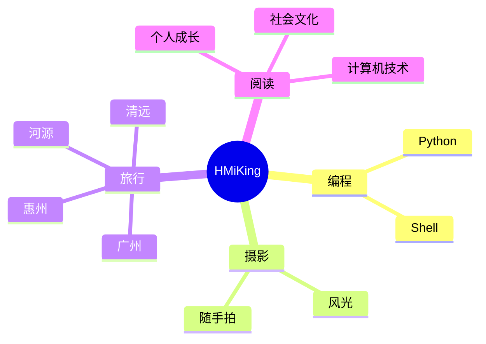

  <!-- dynamic typing effect 动态打字效果 -->
  

    
  

  <!-- knock code pictures 敲代码的图片 -->
   
  <!-- profile logo 个人资料徽标 -->
  

    &emsp;
<!--     &emsp; -->
<!--     &emsp; -->
<!--     &emsp; -->
    &emsp;
    &emsp;
    &emsp;
    <!-- visitor statistics logo 访问量统计徽标 -->
    
  

<!-- Snake Code Contribution Map 贪吃蛇代码贡献图 -->
<picture>
  <source media="(prefers-color-scheme: dark)" srcset="https://cdn.jsdelivr.net/gh/sun0225SUN/sun0225SUN/profile-snake-contrib/github-contribution-grid-snake-dark.svg" />
  <source media="(prefers-color-scheme: light)" srcset="https://cdn.jsdelivr.net/gh/sun0225SUN/sun0225SUN/profile-snake-contrib/github-contribution-grid-snake.svg" />
  
</picture>

#  🙋 Hello

<table>
<tr><td>

<!-- About me 关于我 -->
### 🤺 About Me

&emsp;&emsp;大家好，我是HMiKing。

&emsp;&emsp;热爱羽毛球🏸。

&emsp;&emsp;热爱计算机和IT互联网事业，励志成为一名优秀的学者。

&emsp;&emsp;我们正在以云原生的方式优化世界，通过微服务的灵活运用和弹性扩展的构建卓越系统。

<strong>&emsp;&emsp;We are optimizing the world in a cloud-native way, building exceptional systems through the flexible use of microservices and resilient scaling.</strong>

</td></tr>

<tr>
<td>
  
<!-- 近期博客 -->
### 📃 Recent Blog

<!-- START_SECTION:blog -->
* <a href='https://www.oldit.cn/2023/10/10/04741%20计算机网络原理(自考)/' target='_blank'>计算机网络原理(自考)</a> - 2023-10-10
* <a href='https://www.oldit.cn/2023/10/10/Centos7%20编译安装Nginx/' target='_blank'>Centos7 编译安装 Nginx </a> - 2023-10-10
* <a href='https://www.oldit.cn/album/' target='_blank'>相册集 | 记录每一帧</a> - 2023-10-10
* <a href='https://www.oldit.cn/2023/10/10/Keepalived+Nginx双机热备实验/' target='_blank'>Keepalived+Nginx 双机热备实验</a> - 2023-10-10
* <a href='https://www.oldit.cn/about/' target='_blank'>关于我</a> - 2023-10-10
<!-- END_SECTION:blog -->

</td></tr>

<tr><td>

<!-- ########################################## 分割 ########################################## -->

