  <!-- dynamic typing effect 动态打字效果 -->
  

    
  

  <!-- knock code pictures 敲代码的图片 -->
   
  <!-- profile logo 个人资料徽标 -->
  

    &emsp;
<!--     &emsp; -->
<!--     &emsp; -->
<!--     &emsp; -->
    &emsp;
    &emsp;
    &emsp;
    <!-- visitor statistics logo 访问量统计徽标 -->
    
  

<!-- Snake Code Contribution Map 贪吃蛇代码贡献图 -->
<picture>
  <source media="(prefers-color-scheme: dark)" srcset="https://cdn.jsdelivr.net/gh/sun0225SUN/sun0225SUN/profile-snake-contrib/github-contribution-grid-snake-dark.svg" />
  <source media="(prefers-color-scheme: light)" srcset="https://cdn.jsdelivr.net/gh/sun0225SUN/sun0225SUN/profile-snake-contrib/github-contribution-grid-snake.svg" />
  
</picture>

#  🙋 Hello

<table>
<tr><td>

<!-- About me 关于我 -->
### 🤺 About Me

&emsp;&emsp;大家好，我是HMiKing。

&emsp;&emsp;热爱羽毛球🏸。

&emsp;&emsp;热爱计算机和IT互联网事业，励志成为一名优秀的学者。

&emsp;&emsp;我们正在以云原生的方式优化世界，通过微服务的灵活运用和弹性扩展的构建卓越系统。

<strong>&emsp;&emsp;We are optimizing the world in a cloud-native way, building exceptional systems through the flexible use of microservices and resilient scaling.</strong>

</td></tr>

<tr>
<td>
  
<!-- 近期博客 -->
### 📃 Recent Blog

<!-- START_SECTION:blog -->
* <a href='https://www.oldit.cn/2023/10/10/04741%20计算机网络原理(自考)/' target='_blank'>计算机网络原理(自考)</a> - 2023-10-10
* <a href='https://www.oldit.cn/2023/10/10/Centos7%20编译安装Nginx/' target='_blank'>Centos7 编译安装 Nginx </a> - 2023-10-10
* <a href='https://www.oldit.cn/album/' target='_blank'>相册集 | 记录每一帧</a> - 2023-10-10
* <a href='https://www.oldit.cn/2023/10/10/Keepalived+Nginx双机热备实验/' target='_blank'>Keepalived+Nginx 双机热备实验</a> - 2023-10-10
* <a href='https://www.oldit.cn/about/' target='_blank'>关于我</a> - 2023-10-10
<!-- END_SECTION:blog -->

</td></tr>

<tr><td>

<!-- ########################################## 分割 ########################################## -->

<!-- just img 图片 -->

<!--  skill badge 技能徽章 -->

```mermaid
mindmap
  root((HMiKing))
    编程
      Python
      Shell
    证书
      网络工程师（软考）
      国家励志奖学金
      广东省技能大赛某赛项证书 x 2
    摄影
      风光
      随手拍
    旅行
      广州
      惠州
      河源
      清远
    阅读
      个人成长
      社会文化
      计算机技术
```

💪 正在学习

💡 我的技能

🧰 常用的工具

<!-- programming tool icon 编程工具图标 -->
 

<!-- svg -->

 

 

<!-- gif -->

<!-- just img 图片 -->

<!-- ########################################## 分割 ########################################## -->

<!-- GitHub 奖杯🏆 -->
 

<!-- ########################################## 分割 ########################################## -->

<!-- Star 2023-->

 
  
<!-- 数据展示-主题&theme=radical-->
<!-- &emsp; -->

<!-- &emsp; -->

<!--Link-Speed-->

Link-Speed

 

<!--Line跑码线-->

<!--贡献速度-->

<!-- Github数据展示-->

 

<!-- 奖杯-->

<!--使用的语言-搬砖动画-->

 

<!-- CSDN-bili 数据-->

  

<!--LINE-->

<!--极客挑战-->

<!--小火车-->

<!--LINE-->

</td></tr>
<!--动作效果-->
<h4 align="">  &nbsp;&nbsp;&nbsp;&nbsp;&nbsp;&nbsp;&nbsp;&nbsp;&nbsp;&nbsp;&nbsp;&nbsp;&nbsp;&nbsp;&nbsp;&nbsp;&nbsp;&nbsp;&nbsp;&nbsp;&nbsp;&nbsp;&nbsp;&nbsp;&nbsp;&nbsp;&nbsp;&nbsp;&nbsp;&nbsp;&nbsp;&nbsp;&nbsp;<td></h4>

<!-- ########################################## 分割 ########################################## -->

<!-- GitHub metrics 信息指标 -->

<!-- just img 图片 -->

<!-- just img 图片 -->

